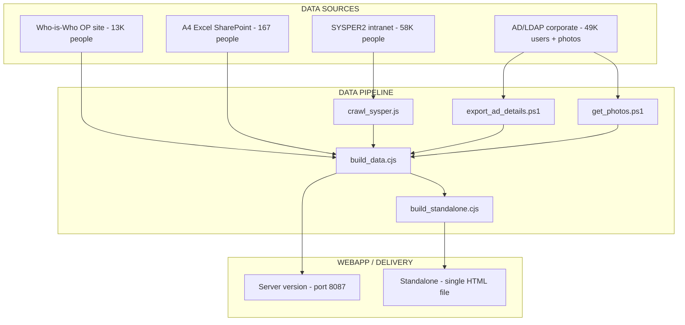
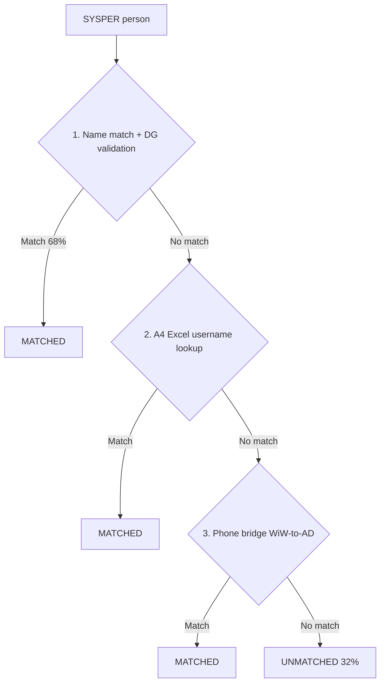
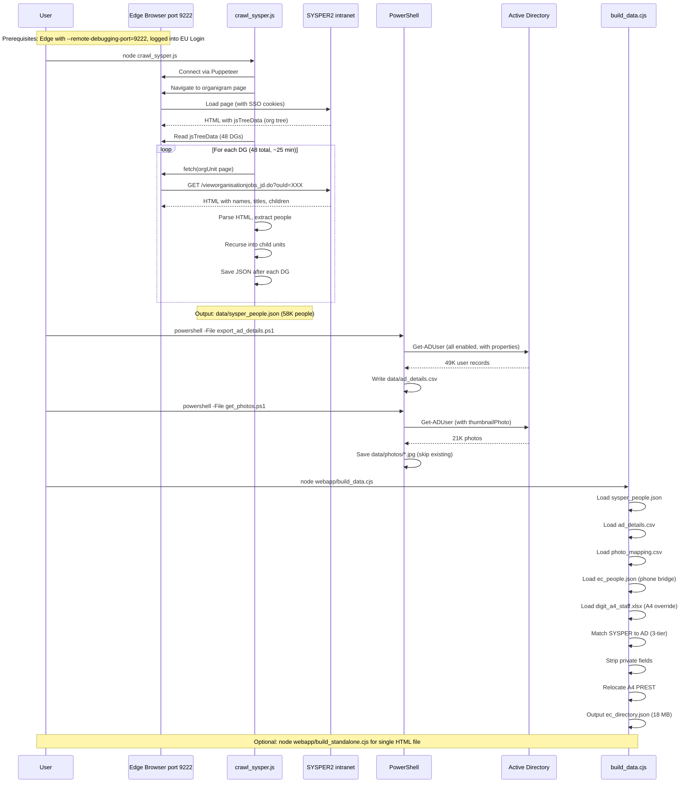

# EC Directory Explorer — Architecture

## 1. Overview

The EC Directory Explorer ("Who's Who") is an internal tool that aggregates staff data from multiple European Commission sources into a fast, searchable organigram web application.

It exists in two deployment modes:
- **Server version** — served via HTTP (port 8087), includes photos, supports live updates
- **Standalone version** — single self-contained HTML file (~18 MB), no server needed, no photos

## 2. System Architecture



## 3. Data Source Details

### 3.1 SYSPER2 (Primary — org structure + names + job titles)

- **URL**: `https://intracomm.ec.testa.eu/SYSPER2/org/vieworganisationjobs_jd.do`
- **Access**: Requires EU Login SSO (via Edge with `--remote-debugging-port=9222`)
- **Method**: In-browser `fetch()` calls via Puppeteer, parsing HTML responses
- **Output**: `data/sysper_people.json` — all staff with name, job title, org unit, location
- **Duration**: ~25-30 minutes for all 48 DGs

### 3.2 Active Directory / LDAP (Enrichment — email, phone, office, photos)

- **Access**: Corporate AD via PowerShell `Get-ADUser`
- **Scripts**: `export_ad_details.ps1` (details), `get_photos.ps1` (thumbnails)
- **Output**: `data/ad_details.csv`, `data/photos/*.jpg`, `data/photo_mapping.csv`
- **Duration**: ~2 min (details), ~5 min (photos, skips existing)

### 3.3 Who-is-Who (Bridge — phone-to-name matching)

- **Source**: Previously crawled from `op.europa.eu` Who-is-Who pages
- **Usage**: Provides phone numbers for people that can bridge SYSPER names to AD records
- **Output**: `data/ec_people.json` (used as fallback matching layer)

### 3.4 DIGIT.A.4 Excel (Override — team relocation)

- **Source**: SharePoint spreadsheet maintained by unit secretariat
- **Usage**: Relocates external providers (PREST) from DIGIT.A.4.005 to their real sectors
- **Output**: Not a file — logic is in `build_data.cjs`

## 4. Data Items by Source

| Field                   | Who-is-Who | AD/LDAP (semi-public)    | Outlook Addr.Book | SYSPER   | Used in app |
|-------------------------|------------|--------------------------|-------------------|----------|-------------|
| Name                    | ✅         | ✅                       | ✅                | ✅       | ✅          |
| Job title/function      | ✅         | ❌ (only Mr/Ms)          | ❌                | ✅       | ✅          |
| Org unit (DG/Unit)      | ✅         | ✅ (department)          | ✅                | ✅       | ✅          |
| Phone                   | ✅         | ✅ (officePhone)         | ✅                | ❌       | ✅          |
| Email                   | ❌         | ✅ (mail)                | ✅                | ❌       | ✅          |
| Location (city)         | ❌         | ✅ (City: BRU/LUX)       | ✅                | ✅       | ✅          |
| Office room             | ❌         | ✅ (Office: L107 08/DCS) | ✅                | ❌       | ✅          |
| Photo                   | ❌         | ✅ (thumbnailPhoto)      | ✅                | ❌       | ✅ (server) |
| Username                | ❌         | ✅ (SamAccountName)      | ❌                | ❌       | ✅          |
| Mobile                  | ❌         | ✅                       | ❌                | ❌       | ❌          |
| EmployeeType (O/ext)    | ❌         | ✅                       | ❌                | ❌       | ❌ (inferred)|
| Statute (FP/CA/CB)      | ❌         | ❌                       | ❌                | ✅ ⚠️    | ❌ private  |
| Function group (AD/AST) | ❌         | ❌                       | ❌                | ✅ ⚠️    | ❌ private  |
| Management flag         | ❌         | ❌                       | ❌                | ✅ ⚠️    | ❌ private  |
| Head of entity          | ❌         | ❌                       | ❌                | ✅ ⚠️    | ❌ private  |
| Occupation type         | ❌         | ❌                       | ❌                | ✅ ⚠️    | ❌ private  |
| Job ID                  | ❌         | ❌                       | ❌                | ✅ ⚠️    | ❌ private  |

**Legend**: ⚠️ = available in SYSPER but NOT public → stripped by `build_data.cjs` before output.

**Privacy rule**: Only fields available in at least one semi-public source (AD, Outlook address book, Who-is-Who) are exposed in the webapp. SYSPER-only fields are used internally for matching but never written to `ec_directory.json`.

## 5. Name Matching Strategy

Matching SYSPER people to AD records (for email/phone/office/photo):



**Cross-DG collision prevention**: When matching by name, verify that the AD `department` field aligns with the SYSPER `dg`. This prevents e.g. "Stephen Collins" in DIGIT from getting the AD data of "Stephen Collins" in RTD.

## 6. Data Update Sequence



## 7. Application Versions

### 7.1 Server Version (`webapp/index.html`)

- Served by any HTTP server (python, Node.js) on port 8087, bind 0.0.0.0
- Fetches `public/ec_directory.json` at runtime
- Serves photos from `public/photos/` (Windows junction → `data/photos/`)
- Features: search, organigram navigation, photo thumbnails, hover tooltips with details
- LAN accessible (any machine on the network)

### 7.2 Standalone Version (`webapp/standalone/*.html`)

- Single self-contained HTML file (~18 MB)
- Data inlined as JavaScript variable
- No server, no network — just double-click to open
- No photos (would add ~55 MB in base64)
- "OFFLINE" badge to distinguish from server version
- Ideal for: sharing via email, USB, SharePoint, offline use

### 7.3 Future: Node.js Server with Self-Update

- Planned replacement of the python HTTP server
- Adds `/api/update` endpoint triggered by UI button
- Checks Edge:9222 for active SSO session
- Runs full pipeline autonomously
- Streams progress to the browser (SSE)

## 8. File Structure

```
datalakes/
├── crawl_sysper.js          # SYSPER2 crawler (puppeteer + fetch)
├── export_ad_details.ps1    # AD details export (PowerShell)
├── get_photos.ps1           # AD photo extraction (PowerShell)
├── active_directory.ps1     # Original AD exploration script
├── data/                    # Raw data (gitignored)
│   ├── sysper_people.json   # Latest SYSPER crawl
│   ├── sysper_people_YYYY-MM-DD.json  # Dated backups
│   ├── ad_details.csv       # AD export
│   ├── photo_mapping.csv    # Photo index
│   ├── photos/              # ~21K JPEG thumbnails
│   ├── ec_people.json       # Who-is-Who crawl (phone bridge)
│   └── digit_a4_staff.xlsx  # A4 team assignments
├── webapp/
│   ├── index.html           # Main app (inline CSS/JS)
│   ├── build_data.cjs       # Merge pipeline
│   ├── build_standalone.cjs # Standalone HTML generator
│   ├── public/
│   │   ├── ec_directory.json        # Merged data (served)
│   │   ├── ec_directory_YYYY-MM-DD.json  # Dated backups
│   │   ├── photos -> ../../data/photos  # Junction (Windows)
│   │   └── favicon.svg
│   └── standalone/          # Generated standalone files (gitignored)
├── PoC_API/                 # OP Portal API exploration (not used)
├── legacy/                  # Old Who-is-Who scraper (superseded)
├── doc/                     # Documentation
│   └── architecture.md      # This file
├── .gitignore
├── CHANGELOG.md
├── README.md
├── catch-up.md
├── todo.md
├── VERSION
└── package.json
```

## 9. Security & Privacy

- **No private data in git**: all `data/`, photos, and standalone builds are gitignored
- **No private SYSPER fields exposed**: statute, function group, management flag, etc. are stripped
- **Only semi-public data in output**: fields available in AD, Outlook address book, or Who-is-Who
- **Credentials**: PoC_API/creds.txt is gitignored
- **External detection**: `@ext.` in email → "(EXT)" badge (inferred from AD, not SYSPER statute)

## 10. Known Limitations

- ~32% of people cannot be matched to AD (mostly external providers not in EC LDAP)
- SYSPER session may timeout during large crawls (~25 min) — use `--resume`
- Photos junction (`mklink /J`) uses absolute path — breaks if project moves
- Standalone file is ~18 MB — may load slowly on older machines
- Maximum 20 pages × 50 results = 1000 via WiW API (not useful below HoU level anyway)
